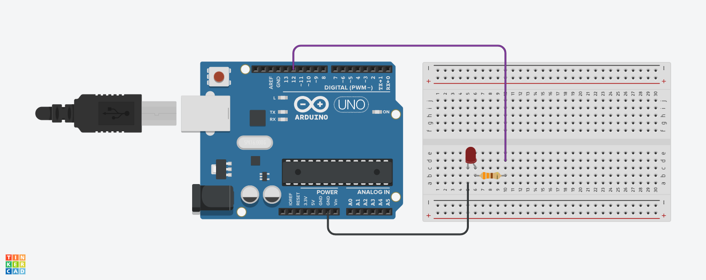

# Practica 01 - Blink

### Introducción
Esta es una práctica para principiantes que ayuda a entender cómo funcionan los bucles (***setup*** y ***loop***) y cómo se pueden controlar los pines de salida. Este es un ejemplo básico de cómo realizar un parpadeo simple con un LED conectado a un pin digital en Arduino.

### Materiales
* 1 x Arduino Uno
* 1 x Diodo LED
* 1 x Resistencia
* 1 x Protoboard 
* Cables Dupont o puentes para protoboard

### Instrucciones
1. Armar el circuito como se muestra en el Layout.
2. Descargar el archivo ***P01_Blink.zip*** del apartado [***Releases***](https://github.com/ColegioMundodePaz/Robotica/releases) y abrir el código ***P01_Blink.ino*** en el IDE de Arduino.
3. Revisar que el código sea correcto y cargarlo al Arduino.

### Layout

