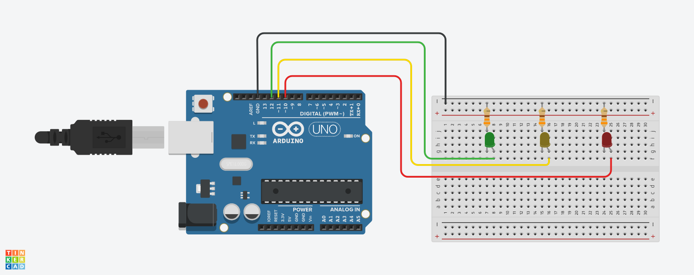

# Practica 01 - Semáforo 

### Introducción
En esta práctica podremos implementar un semáforo simple utilizando un Arduino y una protoboard. Utilizaremos tres LEDs para representar las luces de un semáforo típico: rojo, amarillo y verde.

### Materiales
| Cantidad | Descripción |
| :---: | --- |
| 1 | Arduino Uno |
| 3 | Diodo LED |
| 3 | Resistencia |
| 1 | Protoboard |
| 4 | Cables Dupont M-M |

### Instrucciones
1. Armar el circuito como se muestra en el siguiente Layout.

2. Descargar el archivo ***P02_Semaforo.zip*** del apartado [***Releases***](https://github.com/ColegioMundodePaz/Robotica/releases) y descomprimirlo.
3. Abrir el código ***P02_Semaforo.ino*** en el IDE de Arduino.
4. Revisar que el código sea correcto y cargarlo al Arduino.