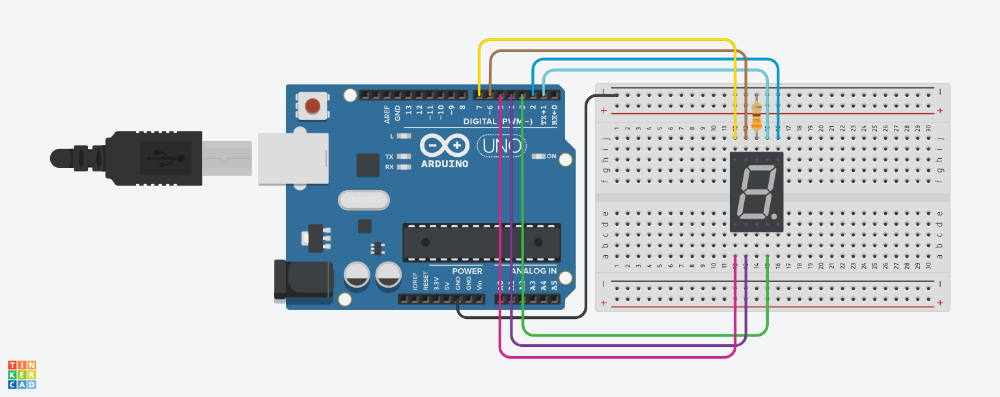

# Practica 03 - Display de 7 segmentos 

### Introducción
Un display de 7 segmentos es un dispositivo de visualización que utiliza siete segmentos individuales para mostrar dígitos numéricos (0-9) y algunas letras (por ejemplo, A-F para representar dígitos hexadecimales). Cada segmento se enciende o apaga de manera independiente.

### Materiales
* 1 x Arduino Uno
* 1 x Resistencia
* 1 x Display de 7 Segmentos cátodo común
* 1 x Protoboard
* Cables Dupont o puentes para protoboard

### Instrucciones
1. Armar el circuito como se muestra en el siguiente Layout.

2. Descargar el archivo ***P03_Display_7s.zip*** del apartado [***Releases***](https://github.com/ColegioMundodePaz/Robotica/releases) y descomprimirlo.
3. Abrir el código ***P03_Display_7s.ino*** en el IDE de Arduino.
4. Revisar que el código sea correcto y cargarlo al Arduino.
