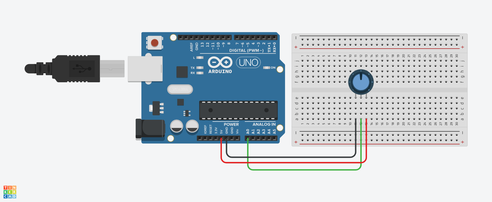

# Practica 04 - Potenciometro 

### Introducción
En esta práctica aprenderemos a utilizar los pines analogos de Arduino utiliazndo un potenciómetro, asi como la comunicación serial del Arduino.

Un potenciómetro es un componente eléctrico que proporciona resistencia variable en un circuito.

> [!NOTE]
> Los pines analogos pueden ser utilizados sin declarar el *pinMode* en el sketch.

### Materiales
| Cantidad | Descripción |
| :---: | --- |
| 1 | Arduino Uno |
| 1 | Potenciómetro |
| 1 | Protoboard |
| 3 | Cables Dupont |

### Instrucciones
1. Armar el circuito como se muestra en el siguiente Layout.

1. Descargar el archivo ***P04_Potenciometro.zip*** del apartado [***Releases***](https://github.com/ColegioMundodePaz/Robotica/releases) y descomprimirlo.
1. Abrir el código ***P04_Potenciometro.ino*** en el IDE de Arduino.
1. Revisar que el código sea correcto y cargarlo al Arduino.
1. Abrir el monitor serial del IDE de Arduino para ver las lecturas del potenciómetro.

> [!IMPORTANT]
> **NO** desconectar el cable USB de la computadora ni del Arduino Uno; el monitor serial debe de estar trabajando a la misma frecuencia que se establecio en el sketch.

<!--

> [!NOTE]
> **NO** desconectar el cable USB de la computadora ni del Arduino Uno; el monitor serial debe de estar trabajando a la misma frecuencia que se establecio en el sketch.

> [!NOTE]
> Highlights information that users should take into account, even when skimming.

> [!IMPORTANT]
> Crucial information necessary for users to succeed.

> [!WARNING]
> Critical content demanding immediate user attention due to potential risks.

-->
