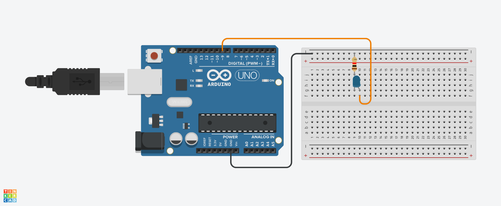

# Practica 01 - PWM 

### Introducción
Práctica en la que aprenderemos a utilizar los pines PWM, regulando la intensidad de un diodo led.

Los pines PWM (Modulación de Ancho de Pulso, por sus siglas en inglés) en Arduino son pines que permiten generar señales PWM. La PWM es una técnica que se utiliza para controlar la cantidad de energía entregada a un dispositivo eléctrico, como un motor o un LED, mediante la variación del ancho de los pulsos de la señal.

> [!NOTE]
> Los pines PWM en las placas de Arduino más comunes, como el Arduino Uno, están marcados con el símbolo **"~"** cerca de su número de pin. 

### Materiales
| Cantidad | Descripción |
| :---: | --- |
| 1 | Arduino Uno |
| 1 | LED |
| 1 | Protoboard |
| 2 | Cables Dupont M-M |

### Instrucciones
1. Armar el circuito como se muestra en el siguiente Layout.

2. Descargar el archivo ***P05_PWM.zip*** del apartado [***Releases***](https://github.com/ColegioMundodePaz/Robotica/releases) y descomprimirlo.
3. Abrir el código ***P05_PWM.ino*** en el IDE de Arduino.
4. Revisar que el código sea correcto y cargarlo al Arduino.
